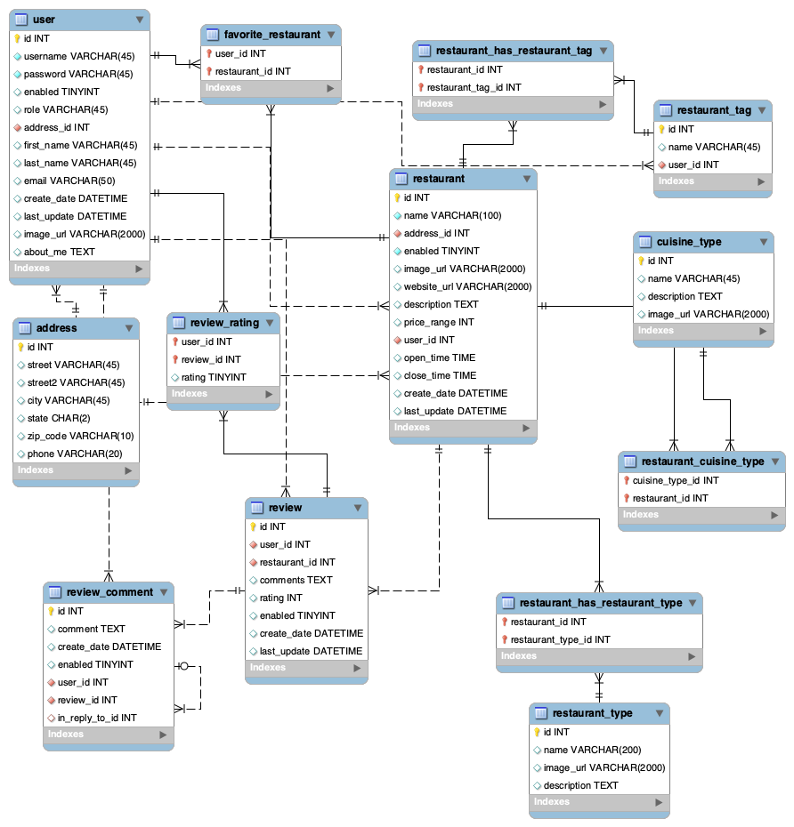

#  ☣️ Polymorphic Plague ☣️ 

## 👻 Ghost Kitchen   

### - Mid-term Team Project for Skill Distillery - 

### Team
 * Miles Porter (Developer, Repo Owner)
 * Michel Okello Mukua (Developer, SQL Database admin)
 * Michael Francavilla (Developer, Scrum Master)
 * Zachary Zink (Developer)

## 👻 Overview

    Develope a website focused on unique local food options. 

## 👻 Description

Ghost Kitchen, developed by Polymorphic Plague, is a web application showcasing a specific set of ghost kitchen restaurants. Users can browse, rate, review, and save their favorite spots, creating a personalized food discovery experience tailored to the digital dining age.

## 👻 Implementation

 This project is a Spring Boot web application developed in Eclipse and backed by  MySQL database. The application is configured to run on a Tomcat server and will be deployed to an AWS EC2. 

## 👻 Technologies Used

 - Java
 - Eclipse
 - Git/GitHub
 - Sublime Text Editor
 - zsh
 - SQL Workbench
 - Spring Boot
 - Gradle
 - Bootstrap
 - AWS
 - Tomcat
 - figma
 - Trello
 - FreeForm

 ## 👻 Database Schema
=======

[SETUP](images/gettingStarted.md) 
[WIREFRAME](images/wireframe.md) 

 ## 👻 Concepts Applied

  - Multi table SQL database creation
  - Conditional Statements
  - Primary Keys (PK) & Foreign Keys (FK)
  - CRUD Operations

 ## 👻 Lessons Learned

    - Mapping Entity with Composite Primary Key
    
    ``@Embeddable 
    public class PartyInvitationId implements Serializable {
        private static final long serialVersionUID = 1L;``

    -   best to have specific jsp for each specific tasks

    -   when working in teams, its import to all work on one Trello task at a time as each task  builds on the previous task. Detailed KanBan cards so we are clear on what we are doing and what needs to be accompliced to to complete the task.

    -   Build out the JSP's as you go so that the effective methods are input into the correct file and are mapped correctly. 

    -   each user need to reload DB to local when its updated at the base level.
            ` mysql -u root -p < DB/ghostkichensdb.sql`

    - Httpsessions needed to be added as parameters in place of model when we need to store the user inport temporarilty. 
    
    - we forgot on mutilple occassion to add out annotations. 
    - you can add boostrap spacing utility with custom CSS to help with table spacing
    [Bootstrap spacing utility](https://getbootstrap.com/docs/5.3/utilities/spacing/)
    -  
    

 ## 👻 How to Download and Run

